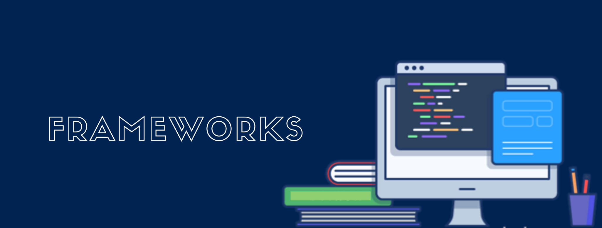
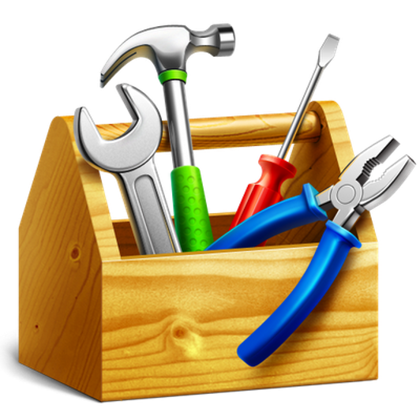
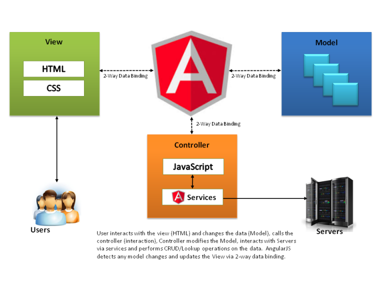
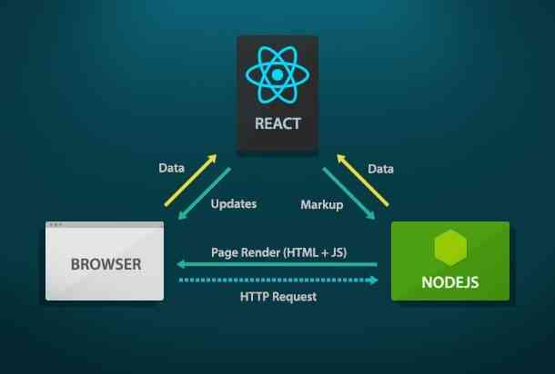
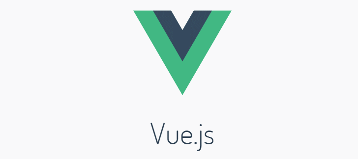
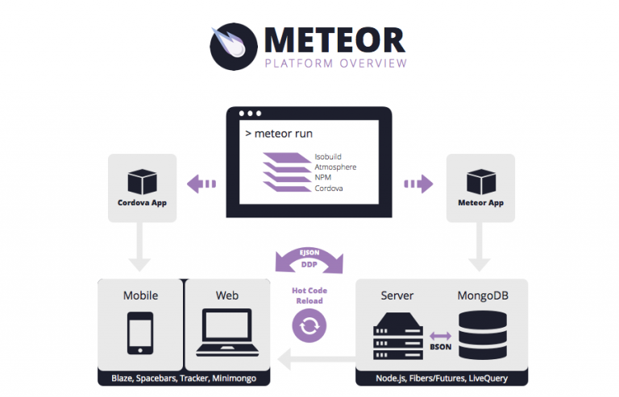
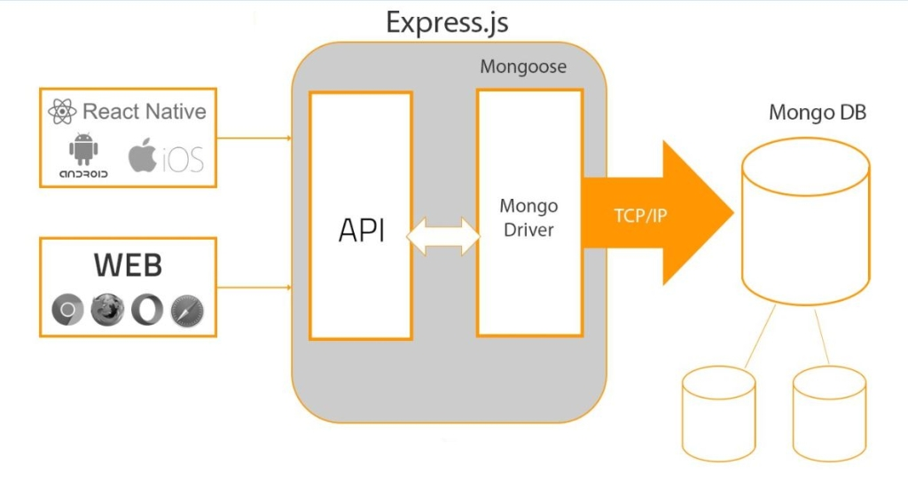
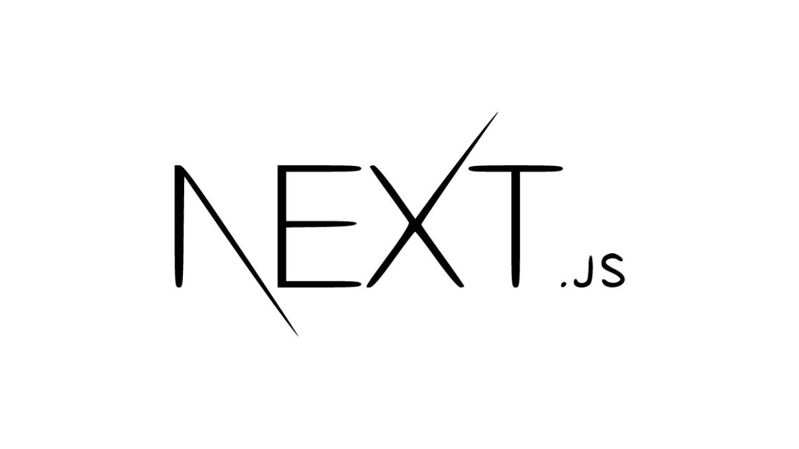
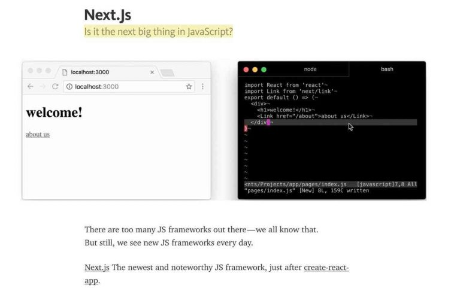

<h1> Mas afinal o que é framework</h2>

Basicamente, é um template com diversas funções que podem ser usadas pelo desenvolvedor. Com ele, é desnecessário gastar tempo para reproduzir a mesma função em diferentes projetos, auxiliando em um gerenciamento ágil de projetos. 
Em outras palavras, ele é uma estrutura base, uma plataforma de desenvolvimento, como uma espécie de arcabouço. Ele contém ferramentas, guias, sistemas e componentes que agilizem o processo de desenvolvimento de soluções, auxiliando os especialistas de TI em seus trabalhos.

  

O Framework é como uma caixa de ferramentas, só que, em vez de chaves de fenda e martelos, há bases para formulários, estilos, validação de campos e conexão com bancos de dados.

Em vez de escrever o mesmo código do zero, os desenvolvedores podem utilizar essas bibliotecas de código para acessar esses blocos de programação.

## 💪 Benefícios

- Menos bugs
- Facilidade de aprendizado
- Padronização de código
- Maior consistência das aplicações
- Redução de custos/tempo

Para cada linguagem existe diversas opções de framework e seria quase impossível falar de todos aqui, por isso escolhi falar dos principais frameworks front-end e back-end de JavaScript para desenvolvimento web. Vale lembrar que a área de desenvolvimento é extremamente dinâmica e o que é considerado top hoje, amanhã pode ser obsoleto.

JavaScript é uma linguagem de programação de alto nível usada principalmente para desenvolver aplicativos da web dinâmicos e páginas da web interativas. A linguagem é usada como o elemento central pela maioria dos sites.
Entre os vários benefícios do JavaScript, um é o suporte a uma ampla variedade de estilos de programação, incluindo programação orientada a objetos, funcional e orientada a eventos.

Existem vários frameworks populares com diferentes recursos e usos, e você deve escolher aquele que se encaixa perfeitamente às suas necessidades em um determinado momento.

 
 

## Angular-JS (Front-End)

AngularJS Lançado em 2016, o Angular alcançou novos patamares em muito menos tempo. A estrutura foi desenvolvida junto com o TypeScript da Microsoft, com o objetivo de tornar o JavaScript mais ágil e atraente para grandes organizações.

É usado principalmente para produção rápida de código, teste fácil de qualquer parte do aplicativo desde o seu lançamento, a estrutura evoluiu além da imaginação e foi considerada a estrutura JS mais usada para o desenvolvimento de aplicativos de página única.

 
 

## React.JS (Front-End)

O React.JS basicamente funciona mais como uma biblioteca do que como um JS Framework. Ele também é considerado o framework JS de crescimento mais rápido, já que existem 1.000 colaboradores dele no Github.
React.JS atua como “V” no padrão MVC (Model-View-Controller), pelo qual pode ser facilmente integrado a qualquer arquitetura.

Além disso, os componentes desta estrutura podem ser criados e reutilizados para aplicativos adicionais e podem ser transferidos para uso público também.
No entanto, o React tem uma curva de aprendizado maior, ele simplesmente torna o desenvolvimento de aplicativos mais fácil de entender.

 
 

## Vue.Js (Front-End)

O Vue 2.0 também foi lançado em 2016, A estrutura também oferece vinculação de dados bidirecional (vista em AngularJS), renderização do lado do servidor (como em Angular2 e ReactJS), Vue-cli (ferramenta de scaffolding para início rápido) e suporte JSX opcional. 
Ele também é considerado mais fácil de aprender em comparação com React e Angular 2.0.

 
 

## Meteor.Js (Back-End)

Meteor é um dos frameworks JavaScript mais populares , que oferece muitos recursos para desenvolvimento back-end, renderização front-end, gerenciamento de banco de dados e lógica de negócios.
O framework cresceu enormemente seu ecossistema desde seu lançamento em 2012. 
Ajuda os desenvolvedores no desenvolvimento rápido de aplicativos móveis e da web ponta a ponta em JavaScript puro.

 
 

## Express (Back-End)

Express é uma das principais estruturas de back-end para codificação JavaScript. É rápido e minimalista e é usado para construir APIs e aplicativos da web. 
Ele funciona principalmente com Angular.js e também é usado como uma estrutura de servidor padrão para Node.js. 
Suas principais características é a facilidade de aprendizagem, desempenho rápido e suporta muitos plug-ins.

 
 

## Next.Js (Back-End)

Next.js é um pequeno framework JavaScript usado principalmente como back-end para desenvolver aplicativos no framework React. 
O principal objetivo do Next é fornecer uma experiência de implementação simples para o desenvolvimento de aplicativos React. 
Suas principais características são, a estrutura minimalista e desempenho rápido, além de oferecer um estilo de programação amigável.

 
 

## Conclusão

JavaScript continua a crescer em demanda e tendência. Esses frameworks são flexíveis, eficientes e repletos de recursos que podem ajudá-lo a desenvolver qualquer tipo de aplicação. 
Além disso, você pode escolher entre uma ampla variedade de estruturas de front-end e back-end para o desenvolvimento de qualquer aplicativo da Web personalizado em JavaScript.

<h2>Entendeu?</h2>

## Fontes

[Blog Geekhunter](https://blog.geekhunter.com.br/frameworks-javascript-e-bibliotecas-java/amp/)

[Hackr Io](https://hackr.io/blog/best-javascript-frameworks)

[Hostgator](https://www.hostgator.com.br/blog/framework-javascript/)

